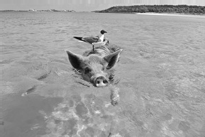
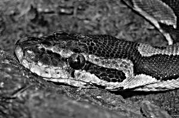
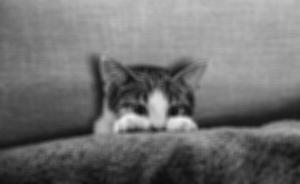
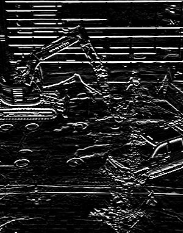
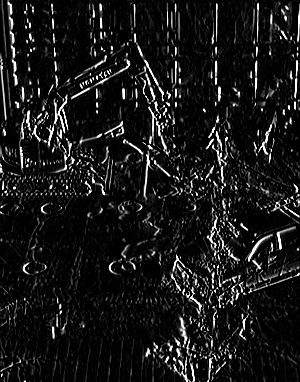
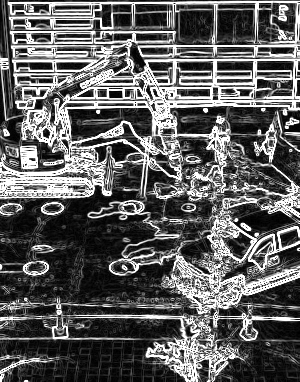

# ling_prog_cc3m

Aluno: João Lucas Saraiva

Disciplina: Linguagens de programação

Professor: Abrantes Araújo Silva Filho

# PSET Manipulação de Imagem CSI

## Questões:
> Vamos começar com uma imagem 4×1 que é definida com os seguintes parâmetros: \
> altura: 1 \
>• largura: 4 \
>• pixels: [29, 89, 136, 200] \
>
> **QUESTÃO 01:** se você passar essa imagem pelo filtro de inversão, qual seria o output esperado? Justifique sua resposta.

R: Sabendo que os pixels podem ser representados em cores nos valores de 0 até 255, sendo o 0 preto e o 255 o branco, e que o inverso de branco é preto (isto é, se invertermos o branco (valor 0) teremos o valor invertido como preto (valor 255), e vice versa). Podemos deduzir que o inverso de preto é o valor máximo que um pixel pode ter, menos o valor da cor preta:

Portanto, os valores inversos da imagem 4x1 dada no enunciado são, respectivamente:

• pixels: [226, 166, 119, 155]

-------------

> QUESTÃO 02: faça a depuração e, quando terminar, seu código deve conseguir passar em todos os testes do grupo de teste TestInvertido (incluindo especificamente o que você acabou de criar). Execute seu filtro de inversão na imagem imagens_teste/peixe.png, salve o resultado como uma imagem PNG e salve a imagem em seu repositório GitHub

No arquivo pset1.py, é possível encontrar no final do arquivo o código que executa esta tarefa. E, na pasta 'repostas' é possível ver a imagem peixe.png com o filtro invertido aplicado.

-------------

> QUESTÃO 3: Considere uma etapa de correlacionar uma imagem com o seguinte kernel: \
[ 0.00 -0.07 0.00 \
-0.45 1.20 -0.25 \
0.00 -0.12  0.00 ]  

> Qual será o valor do pixel na imagem de saída no local indicado pelo destaque vermelho? Observe que neste ponto ainda não arredondamos ou recortamos o valor, informe exatamente como você calculou. Observação: demonstre passo a passo os cálculos realizados.

Para calcularmos a imagem resultande dessa correlação, basta somarmos as multiplicações dos respectivos pixels do kernel com a imagem. Por exemplo, sendo o kernel K[x,y] e a Imagem I[x,y], multiplicaremos K[0,0] com I[0,0], e assim sucessivamente. E por fim teremos:

1) (80 * 0,00) + (53 * (-0,07)) + (99 * 0) + (129 * (-0,45)) + (127 * 1,2) + (148 * (-0,25)) + (175 * 0) + (174 * (-0,12)) + (193 * 0)

2) = 0 + (-3.71) + (0) + (-58.05) + (152.4) + (-37) + 0 + (-20.88) + 0 

3) **= 32.76** -> arredndondando **= 32.80** -> arredondando um pouco mais chegamos em **= 33.00**

-------------

> QUESTÃO 4: quando você tiver implementado seu código, tente executá-lo em imagens_teste/porco.png com o seguinte kernel 9 ×9:
> 
>[ 0 0 0 0 0 0 0 0 0 \
>0 0 0 0 0 0 0 0 0 \
>1 0 0 0 0 0 0 0 0 \
>0 0 0 0 0 0 0 0 0 \
>0 0 0 0 0 0 0 0 0 \
>0 0 0 0 0 0 0 0 0 \
>0 0 0 0 0 0 0 0 0 \
>0 0 0 0 0 0 0 0 0 \
>0 0 0 0 0 0 0 0 0 ]

No arquivo pset1.py está presente a variavél que executa a tarefa. E na pasta Repostas é possivel a imagem 

Porco e passarinho:

-----

> QUESTÃO 5: se quisermos usar uma versão desfocada B que foi feita com um kernel de desfoque de caixa de 3 × 3, que kernel k poderíamos usar para calcular toda a imagem nítida com uma única correlação? Justifique sua resposta mostrando os cálculos

Sim, é possível utilizando uma única correlação.

Operação de nitidez: 

-> S x,y = round( 2 * Ix,y - Bx,y )

Temos por definição que o kernel de identidade é aquele que retorna na saída a mesma imagem da entrada. Então, como temos na fórmula acima o DOBRO da imagem em que queremos aplicar a nitidez, temos:

    | 2 * Ix,y :\           |
    |            [ 0 0 0 \  |
    |              0 2 0 \  |
    |              0 0 0 ]  | 

e, sabemos que o kernel 3 x 3 tem como valores definidos: 

[ 1/9, 1/9, 1/9 \
  1/9, 1/9, 1/9 \
  1/9, 1/9, 1/9 ]

A subtração de 2Ix,y com Bx,y resulta em:

[ -1/9, -1/9, -1/9 \
  -1/9, -17/9, -1/9 \
  -1/9, -1/9, -1/9 ].

No arquivo pset1.py, é possível encontrar na main onde executa essa tarefa. E, na pasta 'Respsotas' é possível ver a imagem cobra.png com a nitidez aplicada. Também no mesmo local, é possível encontrar o código que executa a tarefa da seção 5.1,  está salvo o resultado da aplicação do blur com raio 5 na imagem do gato.

Píton:

Gato:

> QUESTÃO 6: explique o que cada um dos kernels acima, por si só, está fazendo. Tente executar mostrar nos resultados dessas correlações intermediárias para ter uma noção do que está acontecendo aqui.

Cada um dos kernels apresentados é responsável por derivar a imagem com as bordas destacadas, sendo um deles pelo eixo x e outro pelo eixo y.

Kernel Sobel no eixo X apenas:
O Eixo X busca pelas bordas nas horizontais 

Kernel Sobel no eixo Y apenas:
O Eixo Y busca pelas bordas nas verticais

Aplicação da Operação de Sobel completa, segundo a fórmula:

Ox,y = round (√Ox²x,y + Oy² x,y)
A junção dos destaques entre os Eixos X e Y resulta na imagem abaixo

